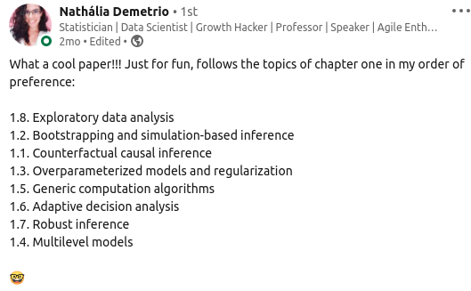
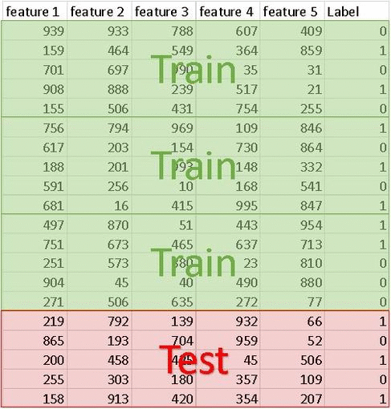

```{r setup, include=FALSE}
library(magrittr)

colorido <- function(x, cor = "#6495ed") {
  glue::glue(
    '<span style="color:{cor}; font-weight: bold;">{x}</span>'
  ) %>% 
    htmltools::HTML()
}

knitr::opts_chunk$set(
  width = "90%",
  echo = FALSE,
  message = FALSE,
  warning = FALSE
)

options(width = 85)
```

```{r xaringan-webcam, include = FALSE}
xaringanExtra::use_webcam()
```


class: middle

# Hoje

--

## Definição de regularização

--

## Exemplo: Lasso

--

## Hiperparâmetros e validação cruzada

--

## Outros tipos de regularização


---

# Os maiores avanços dos últimos 50 anos

.pull-left[

```{r, echo=FALSE}

```

[Post da Nathalia Demétrio](https://www.linkedin.com/posts/nathaliademetrio_the-most-important-statistical-ideas-of-the-activity-6742068233467109376-I0hX)

]

--

.pull-right[

By: [Andrew Gelman & Aki Vehtari](https://arxiv.org/pdf/2012.00174.pdf)

.grey[Counterfactual causal inference]

.grey[Bootstrapping and simulation-based inference]

**Overparameterized models and regularization**

.grey[Multilevel models]

.grey[Generic computation algorithms]

.grey[Adaptive decision analysis]

.grey[Robust inference]

.grey[Exploratory data analysis]

]

---

# Exemplo: venda de tênis

.pull-left[

Você trabalha numa grande empresa de tênis e gostaria de **predizer** a **quantidade de vendas** de uma loja de sua rede a partir de uma base de dados com **mais de 100 variáveis**. 

]

.pull-right[

```{r, out.width="60%", fig.align='center'}

```

]

--

Você escolhe fazer uma **regressão linear**. 

--

Como lidar com a grande quantidade de variáveis?

**Opções**

a. Não me importo. Coloca tudo no modelo!  
b. Utilizo o método *stepwise* para selecionar as variáveis.  
c. Testo todas as combinações de variáveis e escolho a que tem o melhor AIC.  
d. Ajusto um modelo bayesiano com todas as variáveis.  
e. Utilizo penalização L1 nos parâmetros.

**Pollev**: https://PollEv.com/juliotrecent508

---

# Qual estratégia?

<iframe src="https://embed.polleverywhere.com/multiple_choice_polls/4jUSOIKicsdXkiAbByLvp?controls=none&short_poll=true" style="width: 100%; height: 500px; border: 0"></iframe>

---

# O que é regularização?

- É uma **modificação** no algoritmo de aprendizado, usada para **reduzir o erro de predição**, podendo ou não **aumentar o erro de treino**.

--

- Geralmente leva a resultados subótimos na base de treino, mas ajuda a **controlar a variância do modelo** e, com isso, reduzir o erro de predição.

- Em particular, **ajuda a evitar sobreajuste**.

```{r fig.height=3, fig.width=6, fig.align='center', out.width="80%", dpi = 300}
da <- tibble::tibble(
  x = seq(0.1, 5, .01),
  Treino = 1/x,
  `Predição` = 1/x + x/2 + x^2/100
) %>% 
  tidyr::pivot_longer(-x) %>% 
  dplyr::mutate(name = forcats::fct_rev(name))

da %>% 
  ggplot2::ggplot() +
  ggplot2::aes(x, value, colour = name) +
  ggplot2::geom_line(size = 1) +
  ggplot2::coord_cartesian(xlim = c(0.2, 5)) +
  ggplot2::theme_classic(10) +
  ggplot2::theme(
    axis.text = ggplot2::element_blank(),
    axis.ticks = ggplot2::element_blank(),
    legend.position = c(.8, .8)
  ) +
  ggplot2::geom_vline(
    xintercept = 1.38, colour = "red",
    linetype = 2
  ) +
  ggplot2::scale_colour_viridis_d(
    begin = .2, end = .8, option = "A"
  ) +
  ggplot2::labs(
    x = "Capacidade do modelo",
    y = "Erro",
    colour = ""
  ) +
  ggplot2::annotate("text", 2, 8, label = "Sobreajuste") +
  ggplot2::annotate("text", .8, 8, label = "Subajuste")
```

---

# Lasso: restrição nos parâmetros

.grey[*a.k.a.* regressão linear com penalização L1 (módulo)]

**Nome completo**: least absolute shrinkage and selection operator

--

O que faz? minimiza $EQM(\boldsymbol\beta)$ sujeito à

$$\sum_{j=1}^p |\beta_j| \leq B$$
equivalente a minimizar

--

$$EQM(\boldsymbol\beta) + \lambda \sum_{j=1}^p |\beta_j|$$
--

```{r fig.align='center', out.width="30%"}

```

---

<iframe src="https://rseis.shinyapps.io/visLasso" style="width: 100%; height: 600px; border: 0; overflow:hidden;" scrolling="no"></iframe>

---

# Como regularizar na prática?


### Hiperparâmetros

- Usualmente, os métodos de regularização são parametrizados.

- No caso do Lasso, por exemplo, precisamos encontrar um bom valor de $\lambda$.

- Como esses parâmetros estão fora dos dados observados, chamamos de **hiperparâmetros**

--

### Validação cruzada

.pull-left[

- Separamos nossa base em *treino* e *validação*.

- Ajustamos o modelo para vários valores dos hiperparâmetros e verificamos o erro na base de validação.

]

.pull-right[

```{r, out.width="50%", fig.align='center'}

```

]

---

# Comentários

- Lasso não é a única forma de regularizar.

--

- Não existe uma "forma correta" de regularizar. [Não existe almoço grátis!](http://www.no-free-lunch.org)

```{r, out.width="30%", fig.align='center'}

```

--

- Mesmo contexto de **inferência**, regularizar também faz todo sentido.

--

- Os métodos **bayesianos** têm propriedades de regularização por construção, através da **priori**.

--

- É uma área de **pesquisa ativa**. Novos métodos estão sendo estudados e testados até hoje.

---

# Outros tipos de regularização

.pull-left[

- Aumentação de dados

- Aplicação de ruído

- Aprendizado semi-supervisionado

- Aprendizado multi-tarefa

- Compartilhamento de parâmetros

]

--

.pull-right[

- Finalização precoce

- Bagging e outros métodos de *ensemble*

- Dropout

- Treinamento adversarial

- ...

]

--

```{r, fig.align="center", out.width="25%"}

```

---

# Resumo

- Métodos de regularização ajudam a aumentar a performance do modelo.

--

- O Lasso é um método de regularização simples, que penaliza a função de custo pela soma dos valores absolutos dos parâmetros. 

--

- Regularização usualmente envolve hiperparâmetros, que podem ser encontrados através de técnicas de validação cruzada.

--

- Existem diversos métodos de regularização, e eles estão sendo criados até hoje.

---

# Leituras

.pull-left[

<a href="http://www.rizbicki.ufscar.br/ame/" target="_blank">

```{r, out.width="90%"}

```

</a>

]

.pull-right[

.pull-left[

<a href="https://www.deeplearningbook.org" target="_blank">

```{r, out.width="100%"}
knitr::include_graphics(c("img/dlbook.jpg"))
```

</a>

]

.pull-right[

<a href="https://web.stanford.edu/~hastie/ElemStatLearn/" target="_blank">

```{r, out.width="100%"}
knitr::include_graphics(c("img/esl.jpg"))
```

</a>

]

]

---

# Tarefa

1. Leia as partes 1, 5, 6 e 7 do artigo [Statistical Modeling: The Two Cultures](https://projecteuclid.org/download/pdf_1/euclid.ss/1009213726), de Leo Breiman. Se achar interessante, leia tudo!

1. Escreva 2 ou 3 parágrafos explicando a visão do autor sobre a diferença entre os paradigmas de inferência e predição.

1. Com base no que foi discutido na aula de hoje, tente explicar como a regularização ajuda em cada um dos paradigmas.
